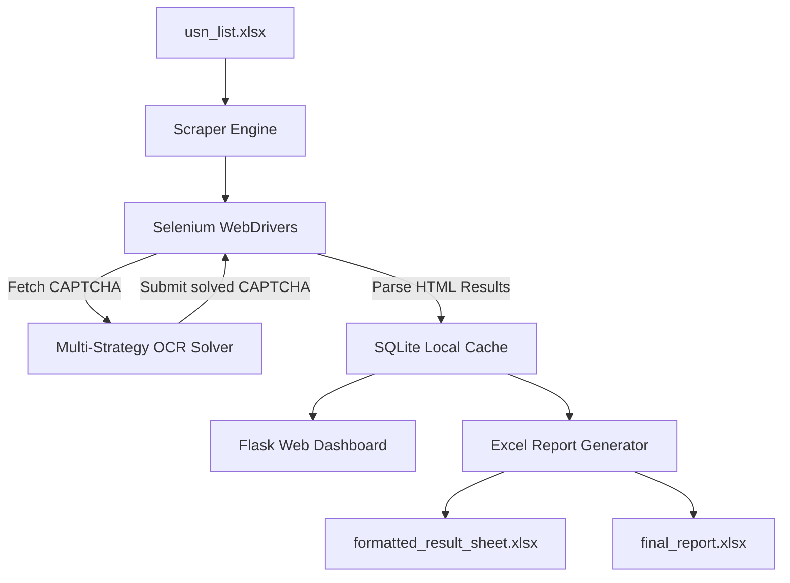

# 🎓 VTU Nexus: Enterprise Results Scraping & Analytics Dashboard

VTU Nexus is a high-performance, multi-threaded academic results extraction, scraping, and analytics system. Powered by a robust Selenium-driven automation engine, a multi-strategy OCR CAPTCHA solver, and a beautiful Flask-based monitoring dashboard, VTU Nexus enables educational institutions to mass-extract student results, solve CAPTCHAs automatically, analyze performance metrics, and generate professional Excel reports.

---

## 🌟 Key Features

- 🏎️ **Multi-Threaded Scraping**: Blazing-fast parallel extraction with built-in concurrency controls, rate limiting, and connection recovery.
- 🧩 **Multi-Strategy CAPTCHA Solver**: Integrates an advanced OCR strategy that targets the word-cloud style CAPTCHAs of the VTU portal with high accuracy.
- 💻 **Real-time Web Dashboard**: An elegant Flask interface displaying real-time scraping stats, logs, individual subject breakdowns, and interactive analytics charts.
- 📊 **Advanced Analytics & Charts**: Subject-wise pass percentages, class averages, top-3 rank lists, and grade distribution metrics are automatically calculated.
- 📈 **High-Fidelity Excel Reports**: Outputs raw results, dynamically styled color-coded Excel sheets (with PASS/FAIL indicators), and print-ready executive summaries.

---

## 🏗️ System Architecture



---

## 📂 Project Structure

- `app.py`: Flask web dashboard coordinator (Endpoints, API, live telemetry, and routing).
- `scraper_engine.py`: Core Selenium multi-threaded scraper engine, WebDriver manager, and session recovery logic.
- `index.py`: Backend script that orchestrates USN database updates and compiles final spreadsheets.
- `templates/`: UI templates for the web portal.
- `usn_list.xlsx`: Input spreadsheet containing target USNs to process.
- `results_output.xlsx` / `formatted_result_sheet.xlsx` / `final_report.xlsx`: Generated result sheets, color-formatted sheets, and executive summary reports.

---

## 🚀 Getting Started

### 1. Prerequisites
- **Python 3.10+**
- **Google Chrome** (The driver is automatically managed by the system)

### 2. Setup & Installation
1. Clone or extract the project folder:
   ```bash
   cd "vtu project"
   ```
2. Create and activate a Python virtual environment:
   ```bash
   python -m venv venv
   # On Windows:
   venv\Scripts\activate
   # On macOS/Linux:
   source venv/bin/activate
   ```
3. Install required libraries:
   ```bash
   pip install flask selenium pandas openpyxl pillow requests easyocr
   ```

### 3. Running the System
1. Populate your target USNs in the first column of `usn_list.xlsx` (or upload it via the web dashboard).
2. Start the web dashboard:
   ```bash
   python app.py
   ```
3. Open your browser and navigate to:
   ```
   http://127.0.0.1:5000
   ```
4. Click **Start Extraction** to watch the multi-threaded scraper run, view solved CAPTCHAs in real-time, monitor individual student scores, and download high-quality Excel sheets.

---

## 🛡️ License & Academic Disclaimer
This project is built for educational demonstration and academic administrative automation. Ensure compliance with university guidelines and terms of service when automating web portals.
